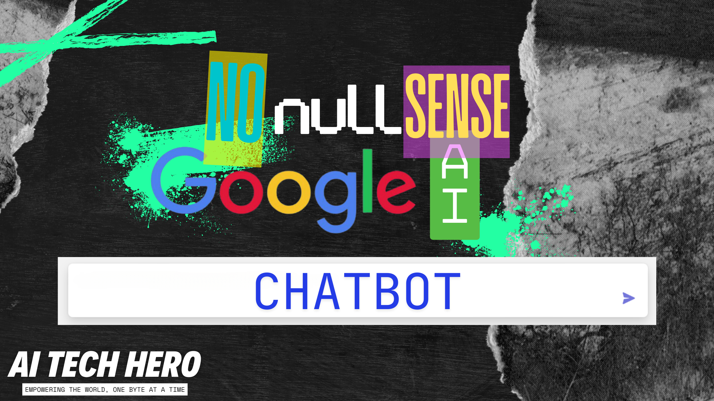

# 🤖 No Nullsense Google AI Chatbot Series

[](link-to-your-youtube-series)
[](https://opensource.org/licenses/MIT)

## The No Nullsense Guarantee

- ✅ No filler content
- ✅ No unnecessary theory
- ✅ No rambling explanations
- ✅ No "like and subscribe" speeches
- ✅ Pure, actionable content
- ✅ No time wasted

## Choose Your Path

- ⚡ Ready to go? Jump to [Quick Start](#quick-start)
- 📚 Need setup help? Start with [Prerequisites](#prerequisites)
- 🤔 Want to learn more? Check out [Series In-Depth](#series-in-depth)

## Table of Contents

- [🤖 No Nullsense Google AI Chatbot Series](#-no-nullsense-google-ai-chatbot-series)
  - [The No Nullsense Guarantee](#the-no-nullsense-guarantee)
  - [Choose Your Path](#choose-your-path)
  - [Table of Contents](#table-of-contents)
  - [Quick Start](#quick-start)
  - [Version Information](#version-information)
  - [Prerequisites](#prerequisites)
    - [Hardware Requirements](#hardware-requirements)
    - [Development Environment](#development-environment)
    - [Required Software \& Versions](#required-software--versions)
    - [Account Requirements](#account-requirements)
    - [Pre-Installation Checklist](#pre-installation-checklist)
  - [Development Environment Setup](#development-environment-setup)
    - [Project Structure](#project-structure)
    - [Setup TODO Checklist](#setup-todo-checklist)
    - [Environment Configuration](#environment-configuration)
  - [Step-By-Step Setup Instructions](#step-by-step-setup-instructions)
  - [Series In Depth](#series-in-depth)
  - [Series Description](#series-description)
    - [Technology Stack](#technology-stack)
    - [This README seems pretty long - what about the no nullsense guarantee? 🤔](#this-readme-seems-pretty-long---what-about-the-no-nullsense-guarantee-)
  - [Time Investment](#time-investment)
    - [Wait, did you say... Practice?? 😲](#wait-did-you-say-practice-)
    - [How Practice Usually Breaks Down For Me](#how-practice-usually-breaks-down-for-me)
    - [Video Format](#video-format)
    - [Per-Episode Breakdown](#per-episode-breakdown)
    - [Expected Outcomes](#expected-outcomes)
    - [Knowledge Prerequisites](#knowledge-prerequisites)
    - [Recommended Learning Path](#recommended-learning-path)
  - [Episode Guide](#episode-guide)
    - [📝 Note: Each episode folder contains](#-note-each-episode-folder-contains)
    - [Ep0-Setup: You're Reading It](#ep0-setup-youre-reading-it)
    - [Ep1-Chatbot-In-A-Flash](#ep1-chatbot-in-a-flash)
    - [Ep2-Deploy-And-Defend](#ep2-deploy-and-defend)
    - [Ep3-Stream-Dream-Machine](#ep3-stream-dream-machine)
    - [Ep4-Style-With-Smile](#ep4-style-with-smile)
    - [Ep5-Production-Perfection](#ep5-production-perfection)
    - [Ep6-Feature-Fiesta](#ep6-feature-fiesta)
    - [Ep7-Enterprise-Evolution](#ep7-enterprise-evolution)
  - [Common Issues](#common-issues)
    - [Google Cloud Authentication](#google-cloud-authentication)
    - [Environment Activation](#environment-activation)
    - [Package Conflicts](#package-conflicts)
    - [Environment Setup](#environment-setup)
    - [Deployment Issues](#deployment-issues)
    - [API Key and Rate Limiting](#api-key-and-rate-limiting)
    - [Other Issues](#other-issues)
  - [Additional Resources](#additional-resources)
  - [Contributing](#contributing)
  - [Project Status](#project-status)
  - [Future Plans](#future-plans)
  - [License](#license)
  - [Acknowledgments](#acknowledgments)
  - [Support \& Community](#support--community)

## Quick Start

```bash
#Linux/MacOS Environment
sudo apt update
sudo apt upgrade

## Clone the repository
git clone https://github.com/aitechhero/nonullsense-googleai-chatbot.git
cd nonullsense-googleai-chatbot

## Create and activate environment
conda env create --file=./environment.yml
conda activate google-chatbot

## Install Node.js and Firebase tools
conda install nodejs
npm install -g firebase-tools

## Install Google Cloud CLI and SDK (if not already installed)
sudo snap install google-cloud-sdk --classic
sudo snap install google-cloud-cli --classic

## Set up Google Cloud credentials
export GOOGLE_APPLICATION_CREDENTIALS="./credentials.json"

## Test the setup
python environment_check.py
python -c "import google.cloud.aiplatform as vertexai; print('Setup successful!')"
```

## Version Information

- Python: 3.9+
- Node.js: 16+
- FastAPI: 0.68.0+
- Google Cloud SDK: Latest version
- VS Code: Any recent version

## Prerequisites

### Hardware Requirements

- **Minimum Specifications:**
  - CPU: Dual-core processor, 2.0 GHz or higher
  - RAM: 8GB minimum, 16GB recommended
  - Storage: 10GB free space
  - Internet: Stable broadband connection (5Mbps+)
- **Recommended Specifications:**
  - CPU: Quad-core processor, 2.5 GHz or higher
  - RAM: 16GB
  - Storage: 20GB free space
  - Internet: High-speed connection (10Mbps+)

### Development Environment

- **IDE:** VS Code (Version 1.80+)
  - Required Extensions:
    - Python (ms-python.python)
    - Pylance
    - Google Cloud Code
    - Thunder Client (for API testing)
  - Recommended Extensions:
    - GitLens
    - Better Comments
    - Auto Close Tag

### Required Software & Versions

- **Python:** Version 3.9+ (3.9.12 recommended)
  - Key Knowledge Areas:
    - Basic syntax and data types
    - Functions and classes
    - Async/await concepts
    - Package management
  - Free Learning Resources:
    - [Python Official Tutorial](https://docs.python.org/3/tutorial/)
    - [Real Python Basics](https://realpython.com/tutorials/basics/)
    - Stay tuned for our `Charming the Snake` series!

- **Node.js:** Version 16+ (16.14.0 LTS recommended)
  - Key Knowledge Areas:
    - Basic JavaScript syntax
    - Async programming
    - Package management (npm)
  - Free Learning Resources:
    - [MDN JavaScript Guide](https://developer.mozilla.org/en-US/docs/Web/JavaScript/Guide)
    - [Node.js Official Docs](https://nodejs.org/docs/latest-v16.x/api/)

- **Google Cloud SDK:** Latest version
  - Required Components:
    - gcloud CLI
    - gsutil
    - bq command-line tool
  - Free Learning Resources:
    - [Google Cloud Skills Boost](https://www.cloudskillsboost.google/paths)
    - [GCP Free Tier Guide](https://cloud.google.com/free)

### Account Requirements

- **Google Cloud Account**
  - Free tier eligible
  - Billing enabled
  - Required APIs:
    - Cloud Run API
    - Cloud Build API
    - Cloud Functions API
    - VertexAI API
  - Estimated Costs: $0-5/month with free tier
    - Note: If you sign up for a free trial, you'll get $300 in credits to use over 90 days. This should be more than enough for this project and the free tier.

### Pre-Installation Checklist

```markdown
Before starting:
[ ] Verify computer meets minimum specifications
[ ] Install VS Code with required extensions
[ ] Install Python 3.9+
[ ] Install Node.js 16+
[ ] Install Git
[ ] Create Google Cloud account
[ ] Enable billing on Google Cloud
[ ] Install Google Cloud SDK
[ ] Configure gcloud CLI
[ ] Test Python installation: `python --version`
[ ] Test Node installation: `node --version`
[ ] Test gcloud installation: `gcloud --version`
```

## Development Environment Setup

### Project Structure

```plaintext
google-chatbot/
├── README.md
├── requirements.txt
├── environment.yml
└── episodes/
    ├── episode1/
    ├── episode2/
    └── ...
```

### Setup TODO Checklist

- [ ] **Install Miniconda:** Download and install the appropriate version for your OS.
- [ ] **Create a conda environment:** `conda create -n google-chatbot python=3.9`
- [ ] **Activate the environment:** `conda activate google-chatbot`
- [ ] **Install required packages:** `conda install nodejs` and `npm install -g firebase-tools`
- [ ] **Create a Google Cloud Project:** [https://cloud.google.com/](https://cloud.google.com/)
- [ ] **Enable billing for the project:** (required for Cloud Functions)
- [ ] **Install the Google Cloud SDK:** [https://cloud.google.com/sdk/docs/install](https://cloud.google.com/sdk/docs/install)
- [ ] **Authenticate with your Google Cloud account:** `gcloud auth login`

### Environment Configuration

```yaml
# Base environment.yml
name: google-chatbot
channels:
  - conda-forge
  - defaults
dependencies:
  - python=3.9
  - pip
  - pip:
    - fastapi
    - uvicorn
    - python-dotenv
    - google-cloud-aiplatform
```

## Step-By-Step Setup Instructions

1. **Install Miniconda:**

    - Head over to the Miniconda download page: [https://docs.conda.io/en/latest/miniconda.html](https://docs.conda.io/en/latest/miniconda.html)
    - Select the installer appropriate for your operating system (Windows, macOS, or Linux).
    - Download the installer and run it.
    - Follow the on-screen instructions. Generally, you can accept the default settings.
    - **Tip:** If you're unsure about any options, it's usually safe to go with the defaults. You can always modify them later.

2. **Create a conda environment:**

    - Open your terminal or command prompt.
    - Create a new conda environment named `google-chatbot` with Python 3.9 using the following command:

        ```bash
        conda create -n google-chatbot python=3.9
        ```

    - Activate the environment:

        ```bash
        conda activate google-chatbot
        ```

    - **Tip:** Using a conda environment keeps your project's dependencies isolated, preventing conflicts with other Python projects or your system's Python installation.

3. **Install required packages:**

    - Make sure your `google-chatbot` environment is activated.
    - We'll need Node.js for the backend Cloud Function and Firebase tools for deploying the frontend. Install them using conda and npm:

        ```bash
        conda install nodejs
        npm install -g firebase-tools  # Install Firebase tools globally
        ```

    - **Tip:** Installing `firebase-tools` globally allows you to use the `firebase` command from any directory on your system.

4. **Create a Google Cloud Project:**

    - Go to the Google Cloud Console: [https://console.cloud.google.com/](https://console.cloud.google.com/)
    - If you don't have a Google Cloud account, create one. It's free to sign up!
    - Once you're logged in, create a new project.
    - Give your project a descriptive name (e.g., "No Nullsense Chatbot").
    - **Tip:** You can create multiple projects to organize your different Google Cloud work.

5. **Enable billing for the project:**

    - In the Google Cloud Console, navigate to the "Billing" section for your project.
    - Link a billing account to your project. You might need to create a new billing account if you don't have one.
    - **Important:** Some Google Cloud services (like Cloud Functions) require billing to be enabled, even if you're using the free tier.
    - **Tip:** Google Cloud offers a generous free tier, so you likely won't incur any charges for this project unless you exceed the free tier limits.

6. **Install the Google Cloud SDK (gcloud CLI):**

    - The gcloud CLI provides command-line tools for managing your Google Cloud resources.
    - Download the installer for your operating system from: [https://cloud.google.com/sdk/docs/install](https://cloud.google.com/sdk/docs/install)
    - Run the installer and follow the on-screen instructions.
    - **Tip:** Make sure to add the gcloud CLI to your system's PATH environment variable so you can access it from any directory.

7. **Authenticate with your Google Cloud account:**

    - Open your terminal or command prompt.
    - Run the following command to authenticate with your Google Cloud account:

        ```bash
        gcloud auth login
        ```

    - This will open a browser window where you can log in to your Google account and grant the necessary permissions.
    - **Tip:** You might need to re-authenticate periodically, especially if you're using multiple Google accounts.

## Series In Depth

## Series Description

This series takes a no-nullsense (no-nonsense) approach to chatbot development, focusing on efficiency and clarity. Each episode is ruthlessly optimized to eliminate fluff and deliver maximum value in minimal time. We'll build a production-ready AI chatbot using Google Cloud's latest technologies and best practices.

### Technology Stack

- **Backend:** FastAPI, Google Cloud VertexAI
- **Frontend:** HTML, CSS, JavaScript
- **Deployment:** Google Cloud Run
- **Monitoring:** Google Cloud Operations
- **Security:** Enterprise-grade authentication & rate limiting

### This README seems pretty long - what about the no nullsense guarantee? 🤔

This readme is long because it covers everything you need to know to get started with the series. It's not filler content - I consider it essential or important information. The series itself is short and to the point, with each episode under 10 minutes. The goal is to provide you with all the necessary context and resources upfront so you can dive straight into the practical implementation.

The README in each episode's folder is direct and no nullsense.

## Time Investment

- 📚 Total Planned Series Length: ~70 minutes (7 episodes × 10 minutes)
- 🎯 Recommended Practice: 2-4 hours per episode
- 🚀 Total Completion Time: 15-30 hours
- ⚡ Quick Results: Working chatbot in first 10 minutes

### Wait, did you say... Practice?? 😲

Practice means hands-on implementation, experimentation, and problem-solving beyond the video tutorials.

- Can I just watch the videos, use your code and be done? 🤔
  - Yes, but you won't learn as much or as quickly. Practice is essential for mastering the material.
- Will your code work for me as you show it? 🤷
  - It should, but you'll learn more by typing it out yourself and experimenting with it. Plus, it's imparative to understand what you're doing, not just copy-paste code. That's how you become an AI Tech Hero. 🦸
  
### How Practice Usually Breaks Down For Me

1. Code Implementation (40% of practice time)
   - Type out and understand the code (don't just copy-paste)
   - Run and test each component
   - Debug any issues that arise
   - Make small modifications to test understanding

1. Experimentation (30% of practice time)
   - Try different parameters and configurations
   - Test edge cases
   - Implement small feature variations
   - Explore related APIs and services

1. Problem-Solving (20% of practice time)
   - Debug deployment issues
   - Fix integration problems
   - Resolve dependency conflicts
   - Troubleshoot error messages

1. Documentation & Notes (10% of practice time)
   - Document your implementation steps
   - Take notes on key concepts
   - Record any issues and solutions
   - Save useful code snippets

### Video Format

- ⏱️ Stopwatch in top-right corner
- 🎯 Every video under 10 minutes - guaranteed
- 🎬 Straight-to-the-point editing
- 💻 Split-screen coding & explanation
- 🔄 No repeated content

### Per-Episode Breakdown

1. **Setup (This README):** 30 minutes
2. **Basic Chatbot:** 10 minutes + ~2 hours practice
3. **Deployment:** 10 minutes + ~3 hours practice
4. **Streaming:** 10 minutes + ~2 hours practice
5. **UI Enhancement:** 10 minutes + ~3 hours practice
6. **Production:** 10 minutes + ~4 hours practice
7. **Features:** 10 minutes + ~3 hours practice
8. **Enterprise:** 10 minutes + ~4 hours practice

### Expected Outcomes

After completing this series, you'll have:

- 🤖 Production-ready AI chatbot
- ☁️ Secure cloud deployment
- 📊 Professional monitoring
- 🔒 Enterprise-grade security
- 🚀 Scalable architecture
- 💼 Portfolio-worthy project

Remember: This series is designed for efficiency, but real learning happens in practice. While each video is under 10 minutes, plan to spend adequate time implementing and experimenting with the concepts covered.

### Knowledge Prerequisites

- **Python Knowledge:**
  - ✅ Variables and data types
  - ✅ Functions and classes
  - ✅ Package management (pip)
  - ✅ Basic async concepts
  - ❓ Advanced topics (helpful but not required):
    - Decorators
    - Context managers
    - Type hints

- **JavaScript/React Knowledge:**
  - ✅ Basic JavaScript syntax
  - ✅ DOM manipulation
  - ✅ React components
  - ✅ State management
  - ❓ Advanced topics (helpful but not required):
    - Hooks in depth
    - React Router
    - Redux

- **Cloud Knowledge:**
  - ✅ Basic cloud concepts
  - ✅ Command line comfort
  - ✅ Basic Git operations
  - ❓ Advanced topics (helpful but not required):
    - Docker
    - Kubernetes
    - CI/CD

### Recommended Learning Path

If you're missing any prerequisites, here's the recommended order:

1. Python Basics (20 hours)
2. JavaScript Fundamentals (20 hours)
3. React Basics (15 hours)
4. Google Cloud Essentials (10 hours)
5. Git Basics (5 hours)

## Episode Guide

### 📝 Note: Each episode folder contains

- 📚 README.md - Step-by-step instructions
- 🛠️ Source code - Complete implementation
- ⚙️ Environment files - Episode-specific setup
- 📝 Configuration - Example configs
- ✅ Tests - Verification scripts

### Ep0-Setup: You're Reading It

- Set up your battle-ready development environment in record time
- Configure Google Cloud Project and authentication
- Install all necessary tools and dependencies
- ⚡ Key Features:
  - VSCode + Miniconda setup
  - Google Cloud SDK configuration
  - Project structure creation
  - Authentication setup

### Ep1-Chatbot-In-A-Flash

- Build a working AI chatbot in under 10 minutes flat
- Deploy a FastAPI backend with VertexAI integration
- Create a clean, minimal chat interface
- [Go to Ep1 folder](/Ep1-ChatbotInAFlash)
- ⚡ Key Features:
  - FastAPI backend implementation
  - VertexAI chat integration
  - Basic HTML/JS frontend
  - Error handling essentials

### Ep2-Deploy-And-Defend

- Secure cloud deployment with enterprise-grade protection
- Implement authentication and rate limiting
- Deploy to Google Cloud Run
- [Go to Ep2 folder](/Ep2-DeployAndDefend)
- ⚡ Key Features:
  - Cloud Run deployment
  - API key authentication
  - Rate limiting system
  - Security headers & CORS

### Ep3-Stream-Dream-Machine

- Add real-time streaming responses
- Implement smart context management
- Handle chat history like a pro
- [Go to Ep3 folder](/Ep3-StreamDreamMachine)
- ⚡ Key Features:
  - Streaming chat responses
  - Chat history management
  - Context window handling
  - Model parameter controls

### Ep4-Style-With-Smile

- Transform your chat UI into a modern masterpiece
- Add markdown and code highlighting
- Implement responsive design
- [Go to Ep4 folder](/Ep4-StyleWithSmile)
- ⚡ Key Features:
  - Modern chat interface
  - Real-time markdown parsing
  - Code syntax highlighting
  - Mobile-responsive design

### Ep5-Production-Perfection

- Add production-grade monitoring
- Implement cost tracking
- Set up auto-scaling
- [Go to Ep5 folder](/Ep5-ProductionPerfection)
- ⚡ Key Features:
  - Cloud Logging integration
  - Performance monitoring
  - Cost optimization
  - Auto-scaling configuration

### Ep6-Feature-Fiesta

- Add power features that users love
- Implement file handling
- Add chat templates
- [Go to Ep6 folder](/Ep6-FeatureFiesta)
- ⚡ Key Features:
  - File upload/processing
  - Multi-model support
  - Chat export functionality
  - Response caching

### Ep7-Enterprise-Evolution

- Transform your chatbot into an enterprise-ready solution
- Implement CI/CD
- Add comprehensive testing
- [Go to Ep7 folder](./Ep7-EnterpriseEvolution)
- ⚡ Key Features:
  - CI/CD pipeline
  - Automated testing
  - Load balancing
  - Disaster recovery

## Common Issues

### Google Cloud Authentication

- **Issue:** "Could not automatically determine credentials..." or "Application Default Credentials Error"
  - **Solution:** Ensure you've run `gcloud auth application-default login` and have set the `GOOGLE_APPLICATION_CREDENTIALS` environment variable correctly. See [Google Cloud Authentication Docs](https://cloud.google.com/docs/authentication/getting-started) for more details.
- **Issue:** Permission errors when accessing Google Cloud resources.
  - **Solution:** Verify that your Google Cloud account has the necessary permissions (e.g., "Cloud Functions Developer," "Cloud Run Admin") for the services you're using. You might need to grant additional roles to your account in the IAM (Identity and Access Management) section of the Google Cloud Console.

### Environment Activation

- **Issue:** "conda command not found"
  - **Solution:** Ensure Miniconda is properly installed and added to your system's PATH environment variable. You might need to restart your terminal or computer after installation.
- **Issue:**  "Environment not found" when activating the `google-chatbot` environment.
  - **Solution:** Make sure you've created the environment correctly using `conda create -n google-chatbot python=3.9`. If the environment still isn't found, try creating it again or check your Miniconda installation.

### Package Conflicts

- **Issue:** Dependency conflicts when installing packages.
  - **Solution:** Use the provided `environment.yml` file to create the conda environment. This ensures you have the correct versions of all required packages. Avoid installing packages manually unless absolutely necessary.

### Environment Setup

- **Issue:**  Problems installing specific packages (e.g., `google-cloud-aiplatform`).
  - **Solution:** Ensure your internet connection is stable. If you're behind a proxy, you might need to configure your proxy settings for conda and pip. You can also try using a different channel (e.g., `conda-forge`) for package installation.
- **Issue:**  "ModuleNotFoundError" when importing packages in your Python code.
  - **Solution:** Verify that the required packages are installed in your active conda environment. You can use `conda list` to see the list of installed packages. If a package is missing, install it using `conda install <package-name>` or `pip install <package-name>`.

### Deployment Issues

- **Issue:**  "Error deploying to Cloud Run" or "Deployment failed."
  - **Solution:** Check the error messages for specific details. Common causes include exceeding quotas, insufficient permissions, or errors in your Dockerfile or deployment configuration. Refer to the Cloud Run documentation for troubleshooting tips.
- **Issue:**  The chatbot web app is not accessible after deployment.
  - **Solution:** Verify that the service is running correctly in the Cloud Run console. Check the service's URL and ensure there are no firewall rules or network configurations blocking access.

### API Key and Rate Limiting

- **Issue:**  "Unauthorized" or "Forbidden" errors when accessing the chatbot API.
  - **Solution:** Ensure you have created an API key and included it in your requests as described in the documentation. If you're using rate limiting, make sure you're not exceeding the request limits.
- **Issue:**  The rate limiting is not working as expected.
  - **Solution:** Double-check your rate limiting configuration in your FastAPI application. Verify that the limits and time windows are set correctly.

### Other Issues

- **Issue:**  The chatbot is not responding correctly or providing unexpected results.
  - **Solution:** Review your chatbot's training data and conversation flows. Ensure the model is trained on relevant data and the dialogues are designed to handle different user inputs.
- **Issue:**  Performance problems or slow response times.
  - **Solution:**  Optimize your code and infrastructure. Consider using caching, asynchronous processing, or scaling up your Cloud Run service to handle increased traffic.

## Additional Resources

- Documentation Links
- Video Resources
- Community Resources
- Learning Materials

## Contributing

1. Fork the repository
2. Create your feature branch (`git checkout -b feature/AmazingFeature`)
3. Commit your changes (`git commit -m 'Add some AmazingFeature'`)
4. Push to the branch (`git push origin feature/AmazingFeature`)
5. Open a Pull Request

Please ensure your PR description clearly describes the changes and references any related issues.

## Project Status

- [x] Episode 0: Setup Guide
- [x] Episode 1: Basic Chatbot
- [ ] Episode 2: Deployment
- [ ] Episode 3: Streaming
- [ ] Episode 4: UI Enhancement
- [ ] Episode 5: Production Features
- [ ] Episode 6: Advanced Features
- [ ] Episode 7: Enterprise Features

## Future Plans

- Mobile app integration
- Multi-language support
- Custom model training
- Community templates

## License

This project is licensed under the MIT License - see the [LICENSE](LICENSE) file for details.

## Acknowledgments

- Google Cloud Platform
- FastAPI community
- All contributors and supporters

## Support & Community

- [AI Tech Hero Discord](https://discord.gg/7tkhqn6b)
- [AI Tech Hero Youtube Channel](https://www.youtube.com/@AITechHero)
- [Issue Tracking](placeholder)
- Contact Information:
  - 📧 [bruteforceagi@gmail.com](mailto:bruteforceagi@gmail.com)
